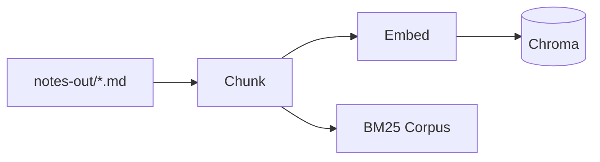
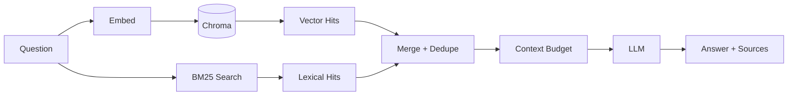

# Chirp Architecture (at a glance)

This guide shows how Chirp moves from audio to answers using a simple, hybrid RAG pipeline. For implementation details, see `notes_chat/`, `notes/`, `transcriber/`, and `config/`.

## Ingestion (index build)

## Retrieval (ask)

- Chunking: section-aware with overlap. See: [Chunking Strategy](./chunking.md)
- Embeddings: Ollama embeddings; same model for chunks and queries. See: [Embedding Backend](./embeddings.md)
- Dedupe key: `(path, content_hash)` so overlapping or repeated text doesn’t show twice
- Why hybrid? See: [Hybrid Retrieval](./hybrid-retrieval.md)

## Components (what exists)

- CLI (`chirp`): entry point to record, process notes, index, and chat
- Recorder + Transcriber: produce transcription and notes
- Note Generator: writes `notes-out/*.md`
- Indexer: chunks, embeds, and stores in Chroma; rebuilds BM25
- Retriever: hybrid search (vector + BM25), merges and builds context
- LLM: answers using the built context
- Storage:
  - Chroma (persistent at `.notes_index/chroma`)
  - BM25 corpus (at `.notes_index/bm25.json`)

## Operations (quick refs)

- Manual notes saved via the CLI are auto-indexed when `notes_chat.auto_index` is enabled.
- See the main `README.md` for commands and usage.

## Configuration

- Main settings live in `config/config.yaml` (paths, models, and RAG tuning)
- Notable knobs (see linked docs for behavior):

  - Chunking: `notes_chat.chunk_size`, `notes_chat.overlap` → [Chunking](./chunking.md)
  - Embeddings: `notes_chat.emb_model`, `models.ollama_url` → [Embeddings](./embeddings.md)
