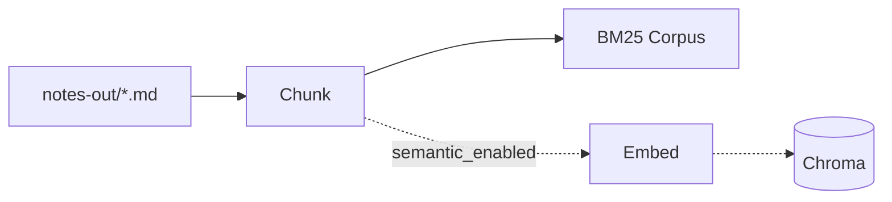
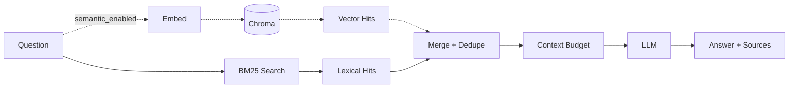

# Chirp Architecture (at a glance)

This guide shows how Chirp moves from audio to answers using a lexical-first RAG pipeline that becomes hybrid when semantic search is enabled. For implementation details, see `notes_chat/`, `notes/`, `transcriber/`, and `config/`.

> The dashed Embed/Chroma steps below run **only when `notes_chat.semantic_enabled`
> is `True`** (opt in with `chirp config --semantic`). By default retrieval is
> BM25-only: ingestion builds the BM25 corpus from note files and skips Chroma,
> and the query path skips the embed + vector steps.

## Ingestion (index build)

## Retrieval (ask)

- Chunking: section-aware with overlap; feeds BM25 always and embeddings when enabled. See: [Chunking Strategy](./chunking.md)
- Embeddings (opt-in): chirpd/MLX embeddings; same model for chunks and queries. See: [Embedding Backend](./embeddings.md)
- Dedupe key: `(path, content_hash)` so overlapping or repeated text doesn’t show twice
- Lexical-first, hybrid when enabled. See: [Retrieval](./hybrid-retrieval.md)

## Components (what exists)

- CLI (`chirp`): entry point to record, process notes, index, and chat
- Recorder + Transcriber: produce transcription and notes
- Note Generator: writes `notes-out/*.md`
- Indexer: chunks notes and builds the BM25 store; also embeds into Chroma when `semantic_enabled`
- Retriever: BM25 by default, fused with vector hits when `semantic_enabled`; merges and builds context
- LLM: answers using the built context
- Storage:
  - BM25 store (at `index_dir/bm25.json`) — always present
  - Chroma (persistent at `index_dir/chroma`) — only when `semantic_enabled`

## Operations (quick refs)

- Manual notes saved via the CLI are auto-indexed when `notes_chat.auto_index` is enabled.
- See the main `README.md` for commands and usage.

## Configuration

- Main settings live in `config/config.yaml` (paths, models, and RAG tuning)
- Notable knobs (see linked docs for behavior):

  - Chunking: `notes_chat.chunk_size`, `notes_chat.overlap` → [Chunking](./chunking.md)
  - Embeddings: the registry's `default_embed` model alias (`chirp models add … --role embed`) → [Embeddings](./embeddings.md)
