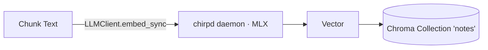

# Embedding Backend

This document explains how embeddings are generated and used in Chirp’s RAG pipeline.

- Code references: `notes_chat/index.py`, `notes_chat/retrieval.py`, `config/settings.py`, `llm/client.py`
- Backend: the bundled **chirpd** daemon, running an embedding model on-device via **MLX** (`llm.client.LLMClient.embed_sync`)
- Embedding model: whatever is registered as the `default_embed` alias in the model registry (`chirp models add <hf-repo> --role embed`, e.g. `mlx-community/bge-small-en-v1.5`)

## Overview

Embeddings convert text into high-dimensional vectors that preserve semantic similarity. Chirp uses embeddings to:

- Index note chunks into a vector database (Chroma)
- Embed queries at retrieval time and run vector similarity search

## Configuration

- The embedding model is the registry's `default_embed` alias — manage it with
  `chirp models add <hf-repo> --role embed`, `chirp models default <alias>`, and
  `chirp models list`. The registry lives in `models.toml`; there is no embedding
  server URL to configure (the daemon is part of the pip install and is
  lazy-spawned by `llm.client`).
- `config/settings.py` hydrates the rest of the app's settings into
  `ChirpSettings`.

## Indexing Flow

- Implemented in `notes_chat/index.py`:
  1. Chunk notes (section-aware + overlapping windows)
  2. For each chunk, compute `content_hash` and embed the batch via chirpd:
     - `LLMClient().embed_sync(inputs=chunk_texts, model="default")`
     - Returns one vector per input, in order
  3. Upsert into Chroma with `ids`, `documents`, `embeddings`, and metadata (including `content_hash`)
  4. Rebuild the BM25 lexicon (`.notes_index/bm25.json`) from Chroma documents

Key method signatures:

- `_get_embeddings(texts: list[str]) -> list[list[float]] | None`
- `collection.add(ids, documents, embeddings, metadatas)`

## Retrieval Flow

- Implemented in `notes_chat/retrieval.py`:
  1. Parse time filter (if present)
  2. Compute the query embedding via chirpd:
     - `_get_query_embedding(...)` → `(client or LLMClient()).embed_sync(inputs=[query], model="default")` and returns the first vector
  3. Query Chroma for top-k semantic matches
  4. Query BM25 for lexical matches
  5. Merge + dedupe using `(path, content_hash)`
  6. Build context under a character budget and pass to the LLM for answering

## Determinism and Model Choice

- Embedding calls are stateless and do not stream; `embed_sync` returns one
  vector per input.
- A small general-purpose English model such as `bge-small-en-v1.5` is suitable
  for note-sized chunks.
- Swap the embedding model by registering a different one and setting it as the
  default embed alias (`chirp models add <repo> --role embed` →
  `chirp models default <alias>`).

## Error Handling

- Indexing (`_get_embeddings`):
  - Raises propagate as `LLMError` subclasses; the indexer maps an embedding
    failure to skipping that file's add-to-index.
- Retrieval (`_get_query_embedding`):
  - Returns `None` on an empty query or any `LLMError`; retrieval then falls back
    to BM25-only results (or an informative suggestion if nothing is found).

Common failure modes and fixes:

- “Failed to get embeddings”: confirm the daemon with `chirp daemon status` and
  that an embed model is registered with `chirp models list`.
- Slow first call: the embed model loads lazily on first use and unloads after
  the idle timeout, so a cold call pays the load cost once.

## Troubleshooting

- `chirp daemon status` — confirm chirpd is healthy.
- `chirp models list` — confirm a `default_embed` alias is registered.
- `chirp init --recheck` — see what's missing.
- From project root, rebuild the index: `uv run chirp index --force`

## Extensibility

- Add other embedding backends behind the same call sites:
  - Index: `_get_embeddings(texts)`
  - Retrieval: `_get_query_embedding(query)`
- Keep `content_hash` unchanged—only the embedding vectors change.
- Consider model-specific normalization or truncation if a target model needs it.

## Privacy

- Embeddings are computed on-device by chirpd (MLX); text never leaves your machine.
- If you later add a hosted embedding backend, review its data policies and
  redact sensitive content as needed before embedding.
