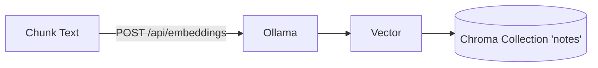

# Embedding Backend

This document explains how embeddings are generated and used in Chirp’s RAG pipeline.

- Code references: `notes_chat/index.py`, `notes_chat/retrieval.py`, `config/config.yaml`, `config/settings.py`, `notes_chat/prompting.py`
- Default backend: [Ollama](https://ollama.com) HTTP API
- Default embedding model: `nomic-embed-text`

## Overview

Embeddings convert text into high-dimensional vectors that preserve semantic similarity. Chirp uses embeddings to:

- Index note chunks into a vector database (Chroma)
- Embed queries at retrieval time and run vector similarity search

## Configuration

- `config/config.yaml`
  - `notes_chat.emb_model`: embedding model name (default `nomic-embed-text`)
  - `models.ollama_url`: Ollama server URL (default `http://localhost:11434`)
- `config/settings.py` hydrates these into `ChirpSettings` used across the app.

## Indexing Flow

- Implemented in `notes_chat/index.py`:
  1. Chunk notes (section-aware + overlapping windows)
  2. For each chunk, compute `content_hash` and call Ollama embeddings:
     - Endpoint: `POST {ollama_url}/api/embeddings`
     - Payload: `{ "model": emb_model, "prompt": chunk_text }`
     - Response: `{ "embedding": [float, ...] }`
  3. Upsert into Chroma with `ids`, `documents`, `embeddings`, and metadata (including `content_hash`)
  4. Rebuild the BM25 lexicon (`.notes_index/bm25.json`) from Chroma documents

Key method signatures:

- `_get_embeddings(texts: list[str]) -> list[list[float]]`
- `collection.add(ids, documents, embeddings, metadatas)`

## Retrieval Flow

- Implemented in `notes_chat/retrieval.py`:
  1. Parse time filter (if present)
  2. Compute query embedding via Ollama:
     - Endpoint: `POST {ollama_url}/api/embeddings`
     - Payload: `{ "model": emb_model, "prompt": query }`
  3. Query Chroma for top-k semantic matches
  4. Query BM25 for lexical matches
  5. Merge + dedupe using `(path, content_hash)`
  6. Build context under a character budget and pass to the LLM for answering

## Determinism and Model Choice

- Embedding calls are stateless and do not stream.
- The chosen model `nomic-embed-text` provides a general-purpose English embedding suitable for note-sized chunks.
- You can swap `notes_chat.emb_model` to another Ollama-compatible embedding model if desired.

## Error Handling

- Indexing (`_get_embeddings`):
  - Non-200 responses cause the whole file’s add-to-index to fail (and be skipped).
  - Connection errors are caught and surfaced via a console message.
- Retrieval (`_get_query_embedding`):
  - Returns `None` on error; retrieval will still return BM25-only results or an informative suggestion if nothing is found.

Common failure modes and fixes:

- “Failed to get embeddings”: ensure Ollama is running and the model is pulled.
- Timeouts: large models or long prompts—verify `ollama serve` and local resources.

## Troubleshooting

- Verify Ollama:
  - `curl {ollama_url}/api/version`
  - `curl {ollama_url}/api/tags` (ensure `notes_chat.emb_model` is listed)
- From project root:
  - Rebuild index: `uv run chirp notes index --force`

## Extensibility

- Add other embedding backends by implementing equivalents of:
  - Index: `_get_embeddings(texts)`
  - Retrieval: `_get_query_embedding(query)`
- Keep `content_hash` unchanged—only the embedding vectors change.
- Consider adding model-specific normalization or truncation if needed by the target API.

## Privacy

- With Ollama running locally, text never leaves your machine.
- If you later switch to a hosted embedding API, review data policies and redact sensitive content as needed before embedding.
